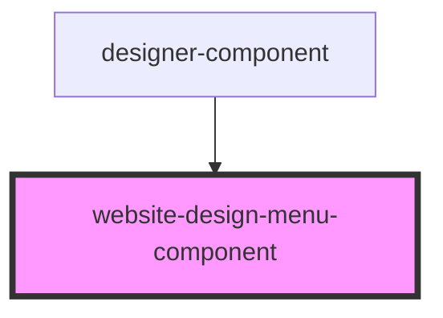

# website-design-menu-component

<!-- Auto Generated Below -->

## Properties

| Property              | Attribute | Description | Type                                      | Default     |
| --------------------- | --------- | ----------- | ----------------------------------------- | ----------- |
| `styleSettings`       | --        |             | `StyleConfigSettings`                     | `undefined` |
| `updateStyleSettings` | --        |             | `(newStyle: StyleConfigSettings) => void` | `undefined` |

## Dependencies

### Used by

 - [designer-component](../designer-component)

### Graph

----------------------------------------------

*Built with [StencilJS](https://stenciljs.com/)*
