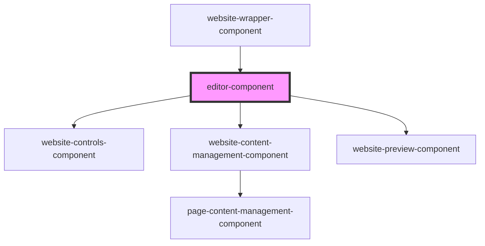

# editor-component

<!-- Auto Generated Below -->

## Properties

| Property  | Attribute | Description | Type      | Default     |
| --------- | --------- | ----------- | --------- | ----------- |
| `website` | --        |             | `Website` | `undefined` |

## Dependencies

### Used by

 - [website-wrapper-component](../website-wrapper-component)

### Depends on

- [website-controls-component](../website-controls-component)
- [website-content-management-component](../website-content-management-component)
- [website-preview-component](../website-preview-component)

### Graph

----------------------------------------------

*Built with [StencilJS](https://stenciljs.com/)*
