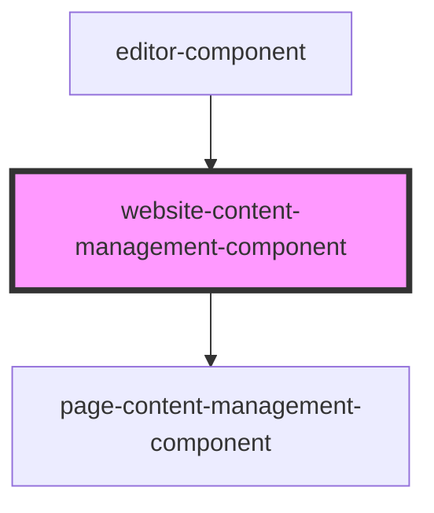

# website-content-management-component

<!-- Auto Generated Below -->

## Properties

| Property      | Attribute | Description | Type                         | Default     |
| ------------- | --------- | ----------- | ---------------------------- | ----------- |
| `pages`       | --        |             | `Page[]`                     | `undefined` |
| `updatePages` | --        |             | `(newPages: Page[]) => void` | `undefined` |

## Dependencies

### Used by

 - [editor-component](../editor-component)

### Depends on

- [page-content-management-component](../page-content-management-component)

### Graph

----------------------------------------------

*Built with [StencilJS](https://stenciljs.com/)*
