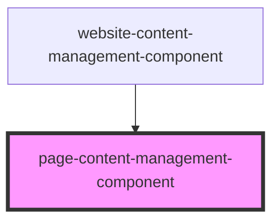

# page-content-management-component

<!-- Auto Generated Below -->

## Properties

| Property     | Attribute  | Description | Type                                   | Default     |
| ------------ | ---------- | ----------- | -------------------------------------- | ----------- |
| `page`       | --         |             | `Page`                                 | `undefined` |
| `position`   | `position` |             | `number`                               | `undefined` |
| `updatePage` | --         |             | `(newElements: PageElement[]) => void` | `undefined` |

## Dependencies

### Used by

 - [website-content-management-component](../website-content-management-component)

### Graph

----------------------------------------------

*Built with [StencilJS](https://stenciljs.com/)*
