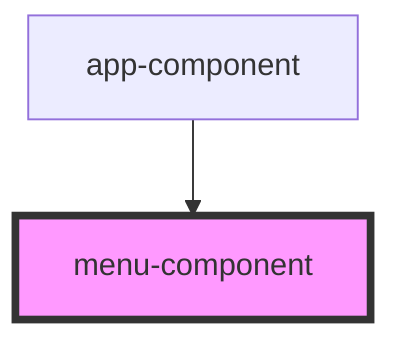

# menu-component

<!-- Auto Generated Below -->

## Properties

| Property          | Attribute          | Description | Type     | Default     |
| ----------------- | ------------------ | ----------- | -------- | ----------- |
| `selectedWebsite` | `selected-website` |             | `string` | `undefined` |

## Events

| Event                 | Description | Type                  |
| --------------------- | ----------- | --------------------- |
| `routeChange`         |             | `CustomEvent<string>` |
| `websiteSelectChange` |             | `CustomEvent<string>` |

## Dependencies

### Used by

 - [app-component](../app-component)

### Graph

----------------------------------------------

*Built with [StencilJS](https://stenciljs.com/)*
