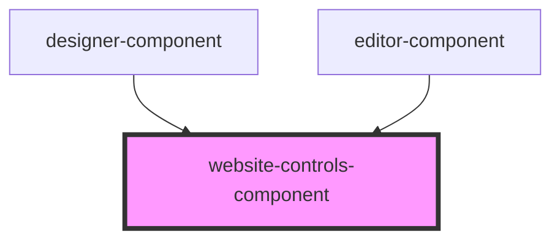

# website-controls-component

<!-- Auto Generated Below -->

## Properties

| Property                 | Attribute                  | Description | Type                            | Default     |
| ------------------------ | -------------------------- | ----------- | ------------------------------- | ----------- |
| `disabled`               | `disabled`                 |             | `boolean`                       | `undefined` |
| `saveChangesHandler`     | --                         |             | `() => void`                    | `undefined` |
| `showPreviewSizeToggle`  | `show-preview-size-toggle` |             | `boolean`                       | `true`      |
| `togglePreviewSizeClick` | --                         |             | `(mobileView: boolean) => void` | `undefined` |
| `undoChangesHandler`     | --                         |             | `() => void`                    | `undefined` |

## Dependencies

### Used by

 - [designer-component](../designer-component)
 - [editor-component](../editor-component)

### Graph

----------------------------------------------

*Built with [StencilJS](https://stenciljs.com/)*
