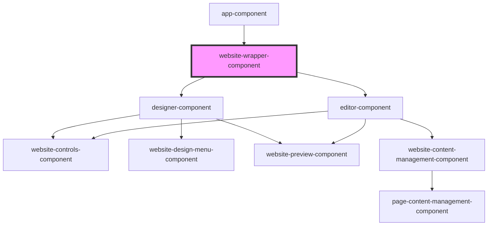

# website-wrapper-component

<!-- Auto Generated Below -->

## Properties

| Property          | Attribute          | Description | Type     | Default     |
| ----------------- | ------------------ | ----------- | -------- | ----------- |
| `route`           | `route`            |             | `string` | `undefined` |
| `selectedWebsite` | `selected-website` |             | `string` | `undefined` |

## Dependencies

### Used by

 - [app-component](../app-component)

### Depends on

- [designer-component](../designer-component)
- [editor-component](../editor-component)

### Graph

----------------------------------------------

*Built with [StencilJS](https://stenciljs.com/)*
